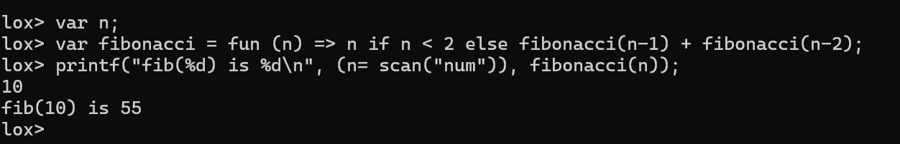

# plox
python implementation of the [Lox](https://craftinginterpreters.com/the-lox-language.html) programming language 


## Usage

Clone the repository 
```sh
$ git clone https://github.com/SujayKarpur/plox.git
$ cd plox
```

Set up and activate a python virtual environment 
```sh
$ python3 -m venv venv
$ source venv/bin/activate
```

Execute the build script
```sh
$ ./build/build.sh
```


Run plox in the desired mode
```sh
$ plox [script] [--debug] [--optimize] [--time]
```


## About 
Lox (from the book Crafting Interpreters) is a dynamically typed, high level scripting language designed to be easy to understand and implement.  

This project is a treewalk interpreter for my version of Lox, with a handcrafted lexer and recursive descent parser.  



## Interface 
### REPL

### Script
### Interpreter Flags 


## Implementation

### Lexical Grammar
### Syntactic Grammar
### Interpreter Architecture
### Types
### Lexing
### Parsing
### AST 
### Interpreter
### State and Environment
### Control Flow 
### Functional Constructs


## References
[Crafting Interpreters](https://craftinginterpreters.com/)  
[Compilers Principles, Techniques, and Tools](https://www.amazon.in/Compilers-2e-Aho/dp/9332518661/ref=sr_1_1?crid=102BX5D3670H2&dib=eyJ2IjoiMSJ9.sZDFB1B_6Fylm6ggOLMgeQ.kPJtxpRyr7W0IIaa4tEUHgAa2MJPrf35HMjO2Ald03I&dib_tag=se&keywords=compileres&qid=1735748598&sprefix=compil%2Caps%2C737&sr=8-1)  
[PLY documentation](https://www.dabeaz.com/ply/ply.html)  

## Current Status


## To Do
- [ ] Improve runtime error handling (print line containing error and show column)
- [ ] Finish README
- [ ] Make list indices lvalues, ie support statements like `variable[i] = value;`
- [ ] Improve documentation and readability 
- [ ] Add functional programming constructs like decorators, generators, and pattern matching
- [ ] Implement a way to import and reuse code across different plox scripts & add a standard library


## Takeaways

### Design Patterns
### Visitor Pattern 
### Global State 
### Static vs Dynamic Typing 
### 

